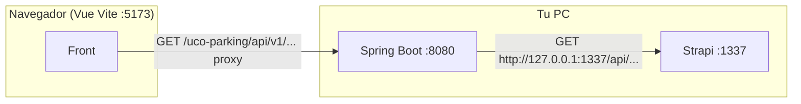

# Strapi como CMS de mensajes (API, interfaz y correo)

Todo el texto visible para el usuario en el **API** (códigos `UCOPARKING-*`), las **cadenas del front Vue** y las **plantillas de correo** de reserva se administran en **Strapi**. El backend Spring lee Strapi al arrancar (y cada `strapi.refresh-ms` ms), cachea en memoria y expone los textos de interfaz en `GET /uco-parking/api/v1/catalogo/textos-ui` para que el navegador no necesite token de Strapi.

## Conexión en local (Strapi en la máquina, `npm run develop` — no Docker)

El navegador **no** llama a Strapi: solo habla con **Spring**. Spring es quien consume la API REST de Strapi.



### 1) Strapi (proyecto web en carpeta propia)

En la carpeta donde tengas Strapi (por ejemplo `ucoparking-strapi/`):

```bash
npm run develop
```

Admin y API suelen quedar en **`http://localhost:1337`**. Colecciones, permisos y semillas: secciones 2–4 de este documento.

### 2) Backend Spring (`Uco.parking`)

Variables de entorno (o `.env` en la raíz del repo, si lo usas):

| Variable | Valor típico (local) |
|----------|----------------------|
| `STRAPI_URL` | `http://127.0.0.1:1337` (recomendado en Windows; evita que `localhost` resuelva a IPv6 si Strapi solo escucha en IPv4) |
| `STRAPI_REMOTE_ENABLED` | `true` |
| `STRAPI_FAIL_ON_STARTUP` | `false` mientras pruebas (si Strapi está apagado, el API igual arranca) |
| `STRAPI_API_TOKEN` | opcional; si Strapi exige token, el mismo que en **Settings → API Tokens** |

Por defecto `application.yml` ya usa `STRAPI_URL` con fallback `http://localhost:1337`.

Arranca Spring en **8080** (puerto y `context-path` del proyecto).

Comprueba que el back ve Strapi (con Strapi en marcha):

```bash
curl -s "http://127.0.0.1:8080/uco-parking/api/v1/catalogo/textos-ui" | head -c 200
```

Deberías ver JSON con claves de interfaz (mapa clave → texto). Ese endpoint está en **permitAll** cuando JWT está activo (`SecurityConfig`).

### 3) Front Vue (`UcoParking-frontend/UcoParking`)

El catálogo UI se pide a **Spring**, no a Strapi:

- URL usada: `API_BASE_URL` + `/catalogo/textos-ui` → por defecto en dev **`/uco-parking/api/v1/catalogo/textos-ui`** (ruta relativa).

En **`.env.local`** (o Infisical en dev) define el proxy de Vite hacia el JAR:

```env
VITE_DEV_API_PROXY_TARGET=http://127.0.0.1:8080
```

Así `npm run dev` en el puerto **5173** enruta `/uco-parking` → Spring en 8080. Sin esto, el front no llega al API.

Solo necesitarías `VITE_API_BASE_URL` con URL absoluta si **no** usas proxy (p. ej. otro host/puerto).

### Orden recomendado al desarrollar

1. Strapi (`npm run develop`)
2. Spring Boot (`8080`)
3. Front (`npm run dev` en `5173`)

---

## Docker (Strapi dentro de contenedores)

Si prefieres Postgres + Strapi con Docker Compose, usa **`docker/strapi/`**. El back sigue conectando con **`STRAPI_URL`** al host/puerto donde escuche Strapi (p. ej. `http://127.0.0.1:1337` si expones **1337** al host). Pasos: **[`docker/strapi/README.md`](../docker/strapi/README.md)**.

## 1. Crear proyecto Strapi

```bash
npx create-strapi-app@latest ucoparking-strapi --quickstart
```

O con Docker + Postgres siguiendo la [documentación oficial](https://docs.strapi.io/).

## 2. Colecciones (Content-Types)

### A) `Mensaje API` → REST plural por defecto `mensaje-apis`

Campos (tipo *Text* o *Rich text* corto):

| Campo | Obligatorio | Descripción |
|--------|-------------|-------------|
| `codigo` | Sí | Igual al enum Java, p. ej. `UCOPARKING-COMMON-001` |
| `textoUsuario` | Sí | Mensaje para el usuario final (español) |
| `textoTecnico` | Sí | Detalle técnico / auditoría |

Publicar todas las entradas. Si el plural en tu Strapi difiere, ajusta `strapi.collection-api-messages` en `application.yml` o la variable `STRAPI_COLLECTION_API`.

### B) `Mensaje UI` → REST plural `mensaje-uis`

| Campo | Obligatorio | Descripción |
|--------|-------------|-------------|
| `clave` | Sí | Identificador estable, p. ej. `dashboard.header.title` |
| `valor` | Sí | Texto en español (admite `{nombreVariable}` para interpolación en front) |

### C) Correo de reserva (también en `Mensaje UI`)

| Clave | Uso |
|--------|-----|
| `email.reserva.asunto` | Asunto del correo SendGrid |
| `email.reserva.cuerpoHtml` | HTML con marcadores `{{nombreEstudiante}}`, `{{cupo}}`, `{{placa}}`, `{{horaInicio}}`, `{{horaFin}}` (el API escapa HTML en los valores) |

## 3. Permisos y token

**No hay tokens “de fábrica” en el repo:** cada instancia de Strapi genera sus propios API Tokens. El valor solo se muestra **completo una vez** al crearlo; después el admin solo enmascara el token. Guárdalo en **Infisical** (`STRAPI_API_TOKEN`) o en un `.env` local que **no** subas a git.

### Opción A — Sin token (solo pruebas locales cómodas)

1. **Settings → Users & Permissions → Roles → Public**: habilita **`find`** y **`findOne`** para los tipos que correspondan a mensajes API y UI (nombres en el admin según tus *Collection Types*).
2. Deja **`STRAPI_API_TOKEN`** vacío en Spring. El `RestClient` no envía cabecera `Authorization` si el token está en blanco (`StrapiClientConfig`).

### Opción B — Con token (recomendado si cierras permisos públicos o en equipos/CI)

1. Inicia sesión en **`http://localhost:1337/admin`** (o la URL donde corra Strapi).
2. **Settings → API Tokens → Create new API Token**.
3. Tipo **Read-only** (o *Custom* solo con `find` / `findOne` sobre las colecciones de mensajes).
4. Copia el token al crearlo y asígnalo al backend:
   - Infisical: clave **`STRAPI_API_TOKEN`**, o
   - Raíz de `Uco.parking`: variable en `.env` (ver `.env.example`), o
   - `infisical run --env=dev -- .\mvnw.cmd spring-boot:run` si ya está en el proyecto Infisical.

Además, en el `.env` del API (o Infisical): `STRAPI_URL`, y `STRAPI_FAIL_ON_STARTUP=true` en producción cuando Strapi sea obligatorio.

### Comprobar el slug REST (Strapi 5)

Si `GET http://127.0.0.1:1337/api/mensaje-uis` devuelve **404**, en el admin abre **Content-Type Builder** → cada colección → pestaña **Advanced Settings** y revisa el **API ID (singular/plural)**. Debe coincidir con `STRAPI_COLLECTION_API` / `STRAPI_COLLECTION_UI` en `application.yml` (por defecto `mensaje-apis` y `mensaje-uis`).

### El front no muestra textos pero Strapi tiene datos

1. **Reinicia Spring** tras cambiar `STRAPI_*` o los mensajes en Strapi (el catálogo se carga al arranque y en el refresco periódico).
2. El backend pide a Strapi el formato REST **v4** (`Strapi-Response-Format: v4`) para poder leer `data[].attributes` como en el parser Java. Sin eso, Strapi 5 devuelve JSON plano y el mapa UI queda vacío.
3. Comprueba en el navegador o con `curl` que **`GET /uco-parking/api/v1/catalogo/textos-ui`** en Spring devuelve JSON con claves (no `{}`). Si es `{}`, revisa logs de arranque: *Catálogo Strapi cargado … UI: N entradas* (`N` debería ser > 0).
4. En el **front**, el proxy Vite debe apuntar al puerto donde corre Spring (`VITE_DEV_API_PROXY_TARGET`, ver arriba).

## 4. Semillas JSON

En `docs/strapi/` encontrarás:

- `seed-mensaje-apis.json` — lista de objetos `{ "codigo", "textoUsuario", "textoTecnico" }` para crear entradas (Content Manager o API REST `POST /api/mensaje-apis`).
- `seed-mensaje-uis.json` — textos de interfaz y plantilla de correo.

Tras importar, verifica en el admin que el estado sea **Published**.

### Verificación con cURL (una petición por fila del seed)

Desde la raíz del repo (con Strapi en marcha y permisos `find` en las colecciones, o token en `STRAPI_API_TOKEN`):

```bash
python scripts/curl_strapi_catalog_per_item.py
```

Solo listar los comandos `curl` sin ejecutarlos:

```bash
python scripts/curl_strapi_catalog_per_item.py --print-curl
```

En Windows PowerShell, si `curl` es alias de `Invoke-WebRequest`, usa el script (invoca `curl.exe`) o ejecuta `curl.exe` manualmente.

## 5. Variables de entorno (API Spring)

| Variable | Ejemplo |
|----------|---------|
| `STRAPI_URL` | `http://localhost:1337` |
| `STRAPI_API_TOKEN` | token de solo lectura |
| `STRAPI_COLLECTION_API` | `mensaje-apis` (si cambias el nombre del tipo) |
| `STRAPI_COLLECTION_UI` | `mensaje-uis` |
| `STRAPI_FAIL_ON_STARTUP` | `true` en producción |
| `STRAPI_REFRESH_MS` | `300000` (5 min) |
| `STRAPI_REMOTE_ENABLED` | `true`. Si es `false`, no se hacen peticiones HTTP (catálogo vacío); en tests se usa `strapi.remote-enabled: false` en `application-test.yml`. |

## 6. Front (Vue)

En `main.js` del front se crea Pinia, se llama a `useUiStringsStore().load()` (petición a `GET .../catalogo/textos-ui` vía `src/api/catalogApi.js`) y después `initAuth0()` y el router. Las vistas usan `useUiText().t('clave')`. Los módulos sin componente usan `trUi('clave')` en `src/utils/uiTranslate.js` (por ejemplo `parkingSpotsApi.js`, `auth0Client.js`). Las claves deben existir en Strapi (`seed-mensaje-uis.json`). Si falta una clave, se muestra la propia clave como marcador hasta publicar el contenido.

## 7. Import / export en Strapi 5 (npm y JSON)

### Error `ERESOLVE` con `strapi-plugin-import-export-entries`

Ese paquete declara peer **`@strapi/strapi@^4.x`**. En este monorepo Strapi va en **versión 5** (`@strapi/strapi@5.x`), por lo que **npm rechaza la instalación**: no mezcles ese plugin con Strapi 5.

### Qué usa este proyecto

- **`@tofandel/strapi-import-export-v3`**: fork para Strapi 5 (import/export desde el Content Manager, formato **JSON v3** del propio plugin). Está declarado en `ucoparking-strapi/package.json` y activado en `config/plugins.ts` como `strapi-import-export`. Variable opcional **`STRAPI_PUBLIC_URL`**: URL pública del servidor para resolver medios en import/export (por defecto `http://127.0.0.1:1337`).
- **`ucoparking-strapi/.npmrc`**: contiene `legacy-peer-deps=true` porque el plugin pide `react-intl@^6.6.8` y Strapi 5.46 trae `6.6.2`; sin eso vuelve a aparecer `ERESOLVE`. Tras clonar el repo, en `ucoparking-strapi/` ejecuta simplemente `npm install`.

### Migración / backup oficial (sin plugin)

Strapi 5 incluye CLI de datos: [Data import](https://docs.strapi.io/cms/data-management/import) y export (archivos `.tar` / directorios con `metadata.json`, `schemas`, etc.). Útil para copiar **todo** el proyecto a otro entorno; no es el mismo formato que el JSON del plugin antiguo de Strapi 4.

### Semillas en JSON del repo

Los archivos en `docs/strapi/*.json` son **payloads REST** pensados para crear filas (p. ej. `POST /api/mensaje-apis`) o para usarlos manualmente; no son el archivo binario/tar del `strapi import` oficial. Si ya tienes un JSON exportado con el **plugin viejo de Strapi 4**, no es compatible con Strapi 5: conviene volver a exportar desde un admin v5 o recrear entradas desde las semillas de este repo.
